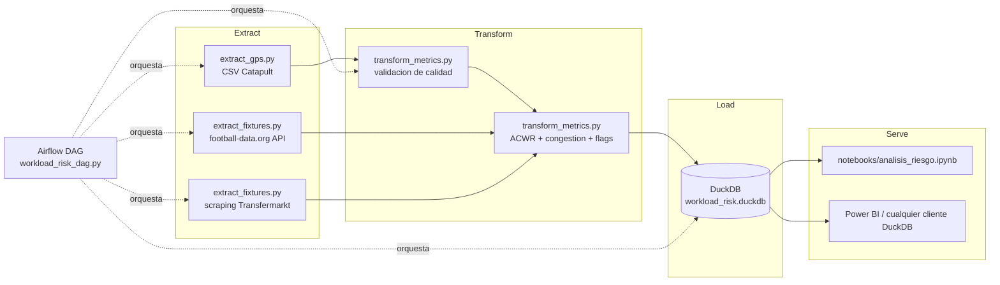

# player-workload-risk

Pipeline de datos batch que calcula el **riesgo de sobrecarga fisica** de los
jugadores de CD Moquegua (Liga 1 Peru) a partir de datos GPS reales de
pretemporada (Catapult Sports), y lo contextualiza contra la **congestion de
calendario** del propio club y, como referencia externa, del Brasileirao
Serie A.

Portfolio tecnico de Data Engineering: extract -> transform -> load ->
orchestrate (Airflow) -> serve (DuckDB + notebook), con una fuente interna
propietaria (anonimizada) y una fuente publica.

## Que calcula

- **ACWR** (Acute:Chronic Workload Ratio) por jugador: carga aguda (media
  movil 7 dias) sobre carga cronica (media movil 28 dias), calculado sobre
  `player_load`. Flag de riesgo si `ACWR > 1.5`.
- **Indice de congestion de calendario**, semanal y normalizado [0, 1], a
  partir de partidos por semana y descanso minimo previo. Se calcula igual
  para CD Moquegua y para el Brasileirao — el Brasileirao **no aporta datos
  fisicos**, solo sirve de referencia de que tan congestionado puede llegar
  a estar un calendario de liga grande.
- **Alerta combinada**: ACWR alto y semana de calendario congestionada al
  mismo tiempo.

## Arquitectura



## Fuentes de datos

| Fuente | Tipo | Modulo |
|---|---|---|
| CSV export Catapult (GPS por sesion) | Interna, privada | `src/extract_gps.py` |
| football-data.org (fixtures Brasileirao Serie A) | Externa, publica | `src/extract_fixtures.py` |
| Transfermarkt (calendario CD Moquegua) | Externa, publica (scraping) | `src/extract_fixtures.py` |

### GPS Catapult

- Export real de Catapult: **100 columnas**, separador variable (`,` o `;`
  segun el archivo — se detecta automaticamente).
- `Split Name == 'all'` aisla el registro integrado de la sesion completa
  por jugador (evita duplicar carga por segmentos parciales de la sesion).
- Clasificacion de sesion (entrenamiento / amistoso / oficial) derivada del
  nombre de archivo y de `Session Title`; solo **entrenamientos** entran al
  calculo de ACWR.
- `num_sprints` (mencionada como columna candidata antes de confirmar
  contra el archivo real) **no existe** en el export de Catapult usado. Se
  omite en vez de aproximarla con una metrica inventada.

### Calendario CD Moquegua (scraping)

Scraping de la pagina de fixtures de Transfermarkt del club. **Es fragil
por diseno**: si Transfermarkt cambia su HTML, el scraper deja de
funcionar. Por eso `scrape_moquegua_calendar()` cae automaticamente a un
snapshot cacheado en `data/sample/moquegua_calendar_sample.csv` (fixtures
reales capturados al construir este proyecto) ante cualquier fallo de red o
de parseo, dejando un log de warning explicito. Ya paso antes con un
scraper de productos de seguros de otro proyecto — se documenta como
limitacion conocida, no como sorpresa.

### Brasileirao Serie A (football-data.org)

Usa el plan gratuito de football-data.org (competicion `BSA`, confirmado
disponible en el free tier). Si `FOOTBALL_DATA_API_KEY` no esta configurada
o la API falla, cae a un fixture mock en
`data/sample/brasileirao_fixtures_mock.json` (equipos reales, calendario
sintetico, marcado explicitamente como mock en el propio archivo) para que
la demo corra sin credenciales.

## Anonimizacion (regla no negociable)

Los CSV de Catapult usados en este proyecto **no vienen anonimizados**: de
30 jugadores del roster de pretemporada, 20 aparecen con apellido real en
la columna `Player Name`. `extract_gps.py` reemplaza cada nombre por un
codigo `Jugador_NN` antes de que el dato salga del modulo. El mapeo
nombre-codigo se guarda en `data/mapping/player_mapping.csv`, **listado en
`.gitignore`, nunca se commitea**. Los CSV originales viven en
`data/raw/`, tambien gitignored.

Nadie que clone este repo puede reconstruir la identidad de los jugadores a
partir de el.

## Como correrlo

### 1. Setup local

```bash
python3 -m venv .venv
source .venv/bin/activate
pip install -r requirements.txt
cp .env.example .env   # completar FOOTBALL_DATA_API_KEY si se tiene una
```

Coloca los CSV de Catapult (no incluidos en el repo) en `data/raw/`.

### 2. Correr el pipeline directamente (sin Airflow)

```bash
source .venv/bin/activate
python -m src.extract_gps        # -> data/processed/gps_metrics.csv
python -m src.extract_fixtures   # -> data/processed/*_fixtures/calendar.csv
python -m src.load_duckdb        # inicializa el schema en DuckDB
jupyter nbconvert --to notebook --execute --inplace notebooks/analisis_riesgo.ipynb
```

El notebook corre transform + load y deja la tabla final de "jugadores en
riesgo" mas un grafico en `data/processed/top_acwr.png`.

### 3. Correr tests

```bash
pytest tests/ -v
```

### 4. Orquestado con Airflow (Docker Compose)

```bash
docker compose up -d --wait
```

Abrir `http://localhost:8080` (usuario `admin`, password `admin`),
activar y disparar el DAG `workload_risk_dag`. Acepta un parametro
`snapshot_date` (no hardcodeado) que filtra el dataset a "todo lo ocurrido
hasta esa fecha".

```bash
docker compose down          # apaga los contenedores
docker compose down -v       # apaga y borra el volumen de Postgres
```

## Estructura del repo

```
player-workload-risk/
├── data/
│   ├── raw/          # CSV originales de Catapult — gitignored
│   ├── mapping/       # mapeo nombre->codigo — gitignored, nunca se commitea
│   ├── sample/        # fixtures mock/cacheados — SI se commitea
│   └── processed/     # artefactos derivados (duckdb, parquet) — gitignored
├── src/                extract_gps.py, extract_fixtures.py, transform_metrics.py, load_duckdb.py, config.py
├── dags/               workload_risk_dag.py (Airflow, TaskFlow API)
├── sql/                schema.sql
├── notebooks/          analisis_riesgo.ipynb
└── tests/              test_transform_metrics.py
```

## Limitaciones honestas

- **Dataset historico, no en vivo**: pretemporada dic 2025 - feb 2026. No
  hay integracion en tiempo real con Catapult ni con el club.
- **La ventana de ACWR se extendio** de "solo enero" (alcance original) a
  diciembre 2025 - enero 2026 completos: con un solo mes, la ventana
  cronica de 28 dias queda incompleta para casi toda la pretemporada. Con
  ~29 dias continuos de datos el ACWR es valido desde antes.
- **Discontinuidad de roster detectada en los datos reales**: entre el 17 y
  el 20 de enero de 2026 el export de Catapult cambia por completo la
  convencion de nombres de jugador (de apellidos en mayuscula/codigos
  `CB-NN` a apellido+inicial), sin overlap entre ambos conjuntos. El
  pipeline anonimiza por string exacto normalizado, asi que no mezcla
  identidades entre ambas convenciones — pero tampoco las une: un jugador
  real que aparezca en ambas ventanas con distinta convencion se cuenta
  como dos codigos distintos, y su historial de ACWR se reinicia. No hay
  forma de resolver esto sin un maestro de roster del club, que no existe
  en los datos disponibles.
- **`alerta_combinada` puede no activarse en este snapshot especifico**: la
  Liga 1 Apertura arranca el 02/02/2026, justo despues del ultimo
  entrenamiento analizado, por lo que las semanas de entrenamiento no se
  solapan con semanas de partido en esta corrida puntual. La logica del
  flag combinado esta cubierta por tests unitarios (`tests/test_transform_metrics.py`)
  y se activaria con datos de una temporada en curso.
- **`num_sprints`** no esta disponible en el export real de Catapult
  usado; se omitio en vez de inventarla.
- El scraping de Transfermarkt es fragil por naturaleza (ver seccion de
  fuentes).

## Referencias

Gabbett, T.J. (2016). *The training-injury prevention paradox: should
athletes be training smarter and harder?* British Journal of Sports
Medicine.
